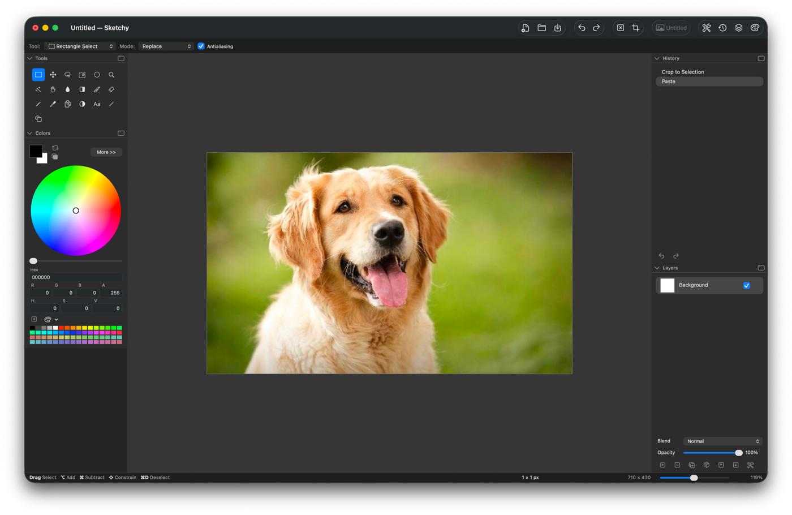

# Sketchy

[sketchy.tools](https://sketchy.tools)

A layered raster image editor for macOS, in the spirit of Paint.NET. Native
AppKit, no third-party dependencies.

## How it works

**Documents and layers.** An image is a stack of layers, each one a
premultiplied BGRA8 bitmap. Layers carry a name, visibility, opacity and one of
fourteen blend modes, and are composited top-down every time the canvas
redraws. Every edit pushes a snapshot onto the history, so the History palette
is a list you can click back into rather than a fixed number of undo steps.

**Tools.** Nineteen of them, each with a one-key shortcut shown in its tooltip
and rebindable under Sketchy ▸ Tool Shortcuts. Tools sharing a key cycle through
each other.

The set is selections, magic wand, brush, pencil, eraser,
bucket, gradient, clone stamp, recolor, colour picker, text, line, and thirteen
shapes. The options bar rebuilds itself around whichever tool is active, so it
only ever shows settings that tool actually uses. Left-drag paints with the
primary colour, right-drag with the secondary.

**Selections.** Hold ⌥ while dragging to add a region, ⌘ to subtract, ⌥⌘ to
intersect; a click with no drag clears the selection. The
magic wand traces the boundary of what it matched, so the marching ants outline
the region rather than hatching it. Move Selection drags and resizes the
outline; Move Selected Pixels lifts the pixels themselves.

**Floating pixels.** Pasted or lifted pixels hover above the canvas at full
size until you commit them, so an image wider than the canvas can be dragged
back into view without losing what hung over the edge. They carry resize
handles, and dragging one past its anchor mirrors them.

**Pixels stay pixels.** Scaling defaults to nearest neighbour, so pixel art
keeps hard edges; switch to Smooth for photographs. The status bar reads out
the size of whatever you are selecting, moving or drawing.

**Palettes.** Tools, Colors, History and Layers float over the window or dock
into either side of it, collapse to their headers, and reflow as the rail
narrows. Documents open as tabs of one window, and the palettes follow the
active tab. The layout is remembered between launches.

**Files.** `.sketchy` is the native format: a binary property list holding the
layer stack with each layer's pixels as PNG. PNG, JPEG, TIFF, BMP, GIF, HEIC
and WebP are read and written, flattened on the way out.

## Issues

Bug reports and feature requests go in
[GitHub Issues](https://github.com/johnaqu1no/Sketchy/issues). For a bug, the
useful things to include are your macOS version, what you did, what happened
instead, and — if the document matters — a `.sketchy` file that reproduces it.

## Support

Questions and help: open a
[discussion](https://github.com/johnaqu1no/Sketchy/issues) or reach out through
[sketchy.tools](https://sketchy.tools).

## License

[Sketchy Source License](LICENSE) — source-available, not open source.

Read the code, build it, change it, and use your own build for anything you
like, including work you are paid for. What you cannot do is hand builds or
source on to other people; that is the part a purchase covers, and it is what
funds the app: <https://sketchy.tools>.

## Credits

Built by John Aquino.

Sketchy is an independent project. It is not affiliated with, endorsed by, or
derived from the Paint.NET source code; it only borrows the interface ideas.
